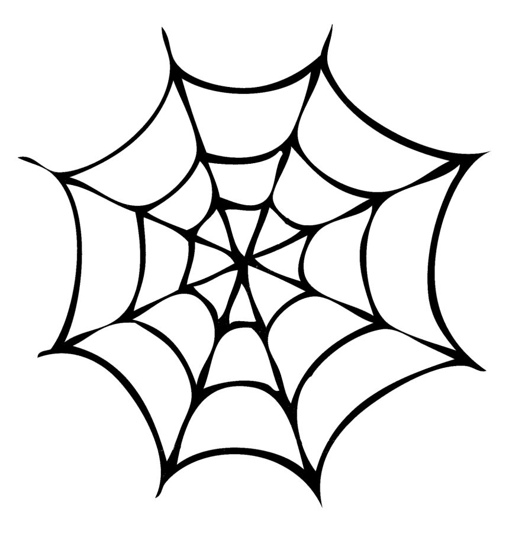

 

    
    <h3 align="center">Spiders-Web</h3>

<!-- About the project -->
## About The Project
A command line tool created to connect to machines using ssh. The goal was to create a web of network monitored devices.